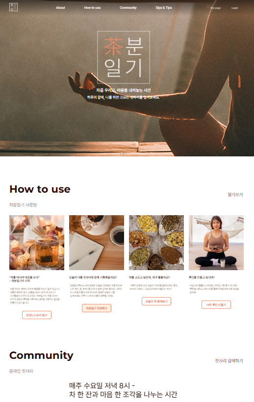

# 🌿 차분일기 (Chaboon Diary)
> 차를 우리고, 마음을 기록하는 감정 기반 티(tea) 루틴 서비스

---

### ☕ About
**차분일기**는 다도(茶道)와 감정 기록을 결합한 감성 웹페이지입니다.  
하루의 감정에 따라 오늘의 차를 추천받고, 나만의 찻자리와 루틴을 기록할 수 있습니다.  
‘차를 우리는 행위로 마음을 내리는 경험’을 웹으로 표현했습니다.

---

### 🛠️ Tech Stack
| Category | Tools |
|-----------|--------|
| **Frontend** | HTML / CSS / JavaScript |
| **Library** | Swiper.js / IntersectionObserver |
| **Design** | Figma / Photoshop |
| **Responsive** | Desktop · Mobile (max-width: 430px) |

---

### ✨ 주요 기능
- 감정 기반 티 루틴 기록 UX 설계  
- Swiper.js 기반 자동재생 메인 슬라이드  
- IntersectionObserver로 구현한 스크롤 인터랙션  
- 모바일/데스크탑 반응형 페이지  
- 차분한 컬러 팔레트와 부드러운 모션 중심 UI  

---

### 🎬 Preview

🔗 **Live Demo**  
[https://jan-nabee.github.io/chaboon-diary-index/](https://jan-nabee.github.io/chaboon-diary-index/)

---

### 👩‍💻 Creator
**문가연 (Moon Ga-yeon)**  
Frontend Developer & Brand Coder  
📧 green-moon@kakao.com  
🌐 [GitHub @Jan-nabee](https://github.com/Jan-nabee)

---

> _"차를 우리며, 마음을 내려놓는 시간.  
> 당신의 하루에 고요한 찻자리를 선물합니다."_ ☕
